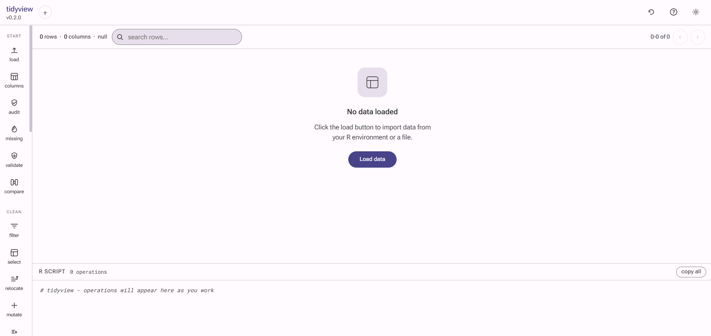
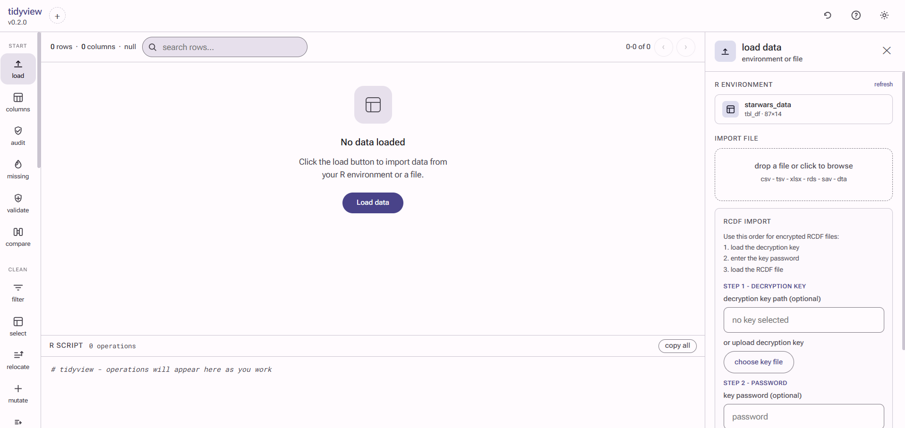
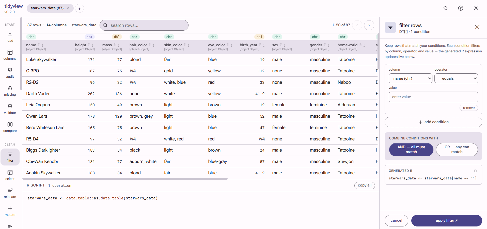
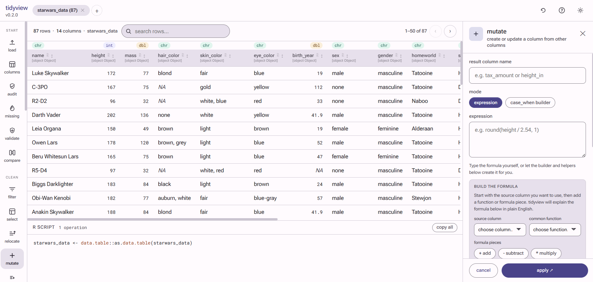
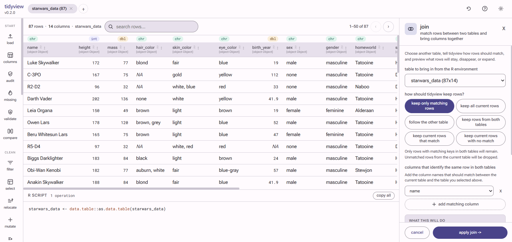
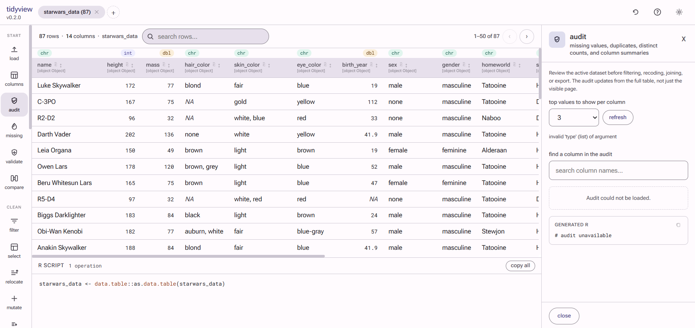
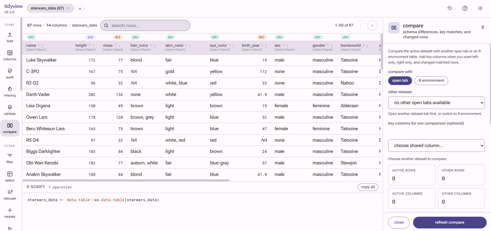
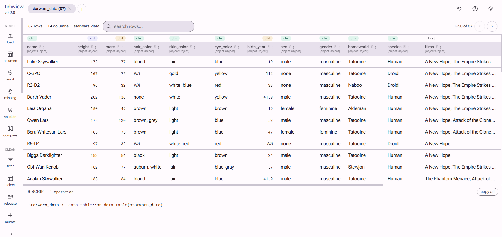

# tidyview

**Guided data workflows with a tidyverse-style UI and paste-ready `data.table` code.**

`tidyview` helps you audit, review missing data, validate, filter, select, mutate, summarise, join, reshape, tabulate,
plot, and export data without writing each step by hand. Every click generates valid,
runnable R code in the script pane so the UI stays transparent and teachable.

It is designed for analysts who want a safer, more guided workflow without hiding the code. Instead of forcing users to
memorize R syntax, `tidyview` explains common tasks in plain language, previews the impact of destructive actions, and
keeps the generated code visible for learning and reuse.

## What's new in 0.2.0

`tidyview 0.2.0` focuses on usability and safety.

- core panels such as `mutate`, `filter`, `recode`, `join`, `drop_na`, and `separate / unite` now use clearer labels and more guided copy
- destructive actions now show stronger warnings and impact summaries before apply
- list-column datasets such as `dplyr::starwars` are now stable in workflows that previously failed, including `mutate` and `drop_na`
- the code pane remains transparent and paste-ready, but the surrounding UI is easier to follow for users who do not write R every day

## Screenshots

Recent updates have focused on making the core panels more guided for non-technical users. The current interface uses:

- clearer labels such as `source column`, `result column`, and `separator text`
- `What This Will Do` summaries before apply
- stronger warnings before destructive steps like recode, join, and drop missing rows
- stable support for list-column datasets such as `dplyr::starwars`

### Startup



### Load Panel



### Filter With Regex



### Mutate Helpers



### Join



### Audit And Compare





### List-Column Data



```r
# install from GitHub
remotes::install_github("elmertumlos/tidyview")

# launch with data from the R environment
tidygui(mtcars)

# launch with a file
tidygui(data.table::fread("sales.csv"), name = "sales")

# just open the import dialog
tidygui()
```

`tidygui()` opens the browser interface on `http://127.0.0.1:7474` by default and keeps the generated R code visible in the script pane as you work.

## Why tidyview

`tidyview` works well when you want to:

- explore and clean a dataset without writing every line from scratch
- teach or learn `data.table` step by step from real generated code
- give non-technical teammates a guided interface for common data tasks
- inspect what will happen before applying a destructive change

The app does not hide the transformation logic. Every operation still writes runnable R code into the script pane.

## Programmatic helpers

The GUI verbs are also available as lightweight helpers that return a
`data.table` with the generated code stored in `attr(x, "tv_code")`.

```r
sales <- tv_fread("sales.csv")
sales <- tv_filter(sales, list(list(col = "region", op = "==", val = "North")))
sales <- tv_mutate(sales, "tax", "amount * 0.12")
sales <- tv_mutate(sales, "region_clean", "tools::toTitleCase(trimws(as.character(region)))")
sales <- tv_arrange(sales, list(list(col = "amount", desc = TRUE)))
audit_report <- tv_audit(sales, top_n = 5L)
missing_report <- tv_missing_summary(sales, group_by = "region")
validate_report <- tv_validate(sales, rules = list(
  list(type = "not_missing", col = "record_id"),
  list(type = "range", col = "amount", min = "0")
))
compare_report <- tv_compare(sales, archived_sales, by = "record_id")
sales_tab <- tv_tabulate(sales, "product", output_name = "sales_tab")
sales_xtab <- tv_crosstab(sales, "region", "product", output_name = "sales_xtab")

attr(sales, "tv_code")
```

## Guided workflows

The highest-use panels are now designed to read more like tasks than R functions.

- `mutate` explains source columns, result columns, and formulas in plain English
- `filter` explains which rows will stay and which columns drive the rule
- `recode` supports safer category relabeling, including partial recodes and grouped category outputs
- `join` previews row changes and explains how matches are kept
- `drop_na` shows how many rows would be removed before apply
- `separate / unite` explains how columns will split or combine and whether the originals stay

This makes the app friendlier for common tasks like converting `height` from centimeters to inches in `starwars`, relabeling categories without accidentally wiping untouched values, previewing join row changes before apply, and safely working with list-column datasets.

## Operations

| GUI panel | `data.table` equivalent |
|-----------|-------------------------|
| Audit data | `tv_audit(DT)` |
| Missing data | `tv_missing_summary(DT, group_by = "region")` |
| Validate data | `tv_validate(DT, rules = list(...))` |
| Compare data | `tv_compare(DT, other, by = c("id"))` |
| Filter rows | `DT[condition]` |
| Select columns | `DT[, .(col1, col2)]` |
| Mutate | `DT[, new := expr]` |
| Summarise | `DT[, .(stat = fn(col)), by = group]` |
| Arrange | `DT[order(col)]` |
| Join tables | `merge(DT, DT2, by = "key")` |
| Pivot long | `melt(DT, id.vars = ..., measure.vars = ...)` |
| Pivot wide | `dcast(DT, formula, value.var = ...)` |
| Tabulate | `DT[, .(n = .N), by = .(col)]` |
| Crosstab | `dcast(DT[, .(n = .N), by = .(row, col)], row ~ col)` |
| Plot | `graphics::plot(...)`, `graphics::hist(...)`, `graphics::barplot(...)` |
| Rename columns | `setnames(DT, old, new)` |
| Distinct | `unique(DT)` |
| Export | `fwrite(DT, "file.csv")` |

## Data audit

`tidyview` now includes a dedicated audit panel for quick data-quality checks:

- overall row and column counts
- missing rows and missing cells
- duplicate row count
- distinct counts by column
- top values, sample values, and simple ranges

Typical generated R looks like:

```r
audit_report <- tv_audit(DT, top_n = 5L)
```

The programmatic helper returns a list with `overview` and `columns` tables,
plus the generated code in `attr(audit_report, "tv_code")`.

## Missing-data dashboard

`tidyview` now includes a dedicated missing-data dashboard so you can focus on
missingness before cleaning.

- missing cells and rows at a glance
- columns sorted by missingness
- optional grouped missingness summary
- quick links into `replace_na` and `drop_na`

Typical generated R looks like:

```r
missing_report <- tv_missing_summary(DT, group_by = "region")
```

## Validation rules

`tidyview` also includes a validation panel for explicit pass/fail checks.

- required / not-missing fields
- unique keys
- allowed values
- regex patterns
- numeric or date ranges
- custom row-wise expressions

Typical generated R looks like:

```r
validate_report <- tv_validate(
  DT,
  rules = list(
    list(type = "not_missing", col = "record_id"),
    list(type = "allowed", col = "status", values = c("Open", "Closed")),
    list(type = "range", col = "age", min = "0", max = "120")
  )
)
```

## Compare data

`tidyview` also includes a compare panel for checking one dataset against another:

- shared columns
- columns only on the left or right
- type mismatches
- matched, left-only, and right-only keys
- changed rows across shared non-key columns when keys are unique

Typical generated R looks like:

```r
compare_report <- tv_compare(current_data, previous_data, by = c("record_id"))
```

## String helpers

`tidyview` does not require `stringr`, but it includes several stringr-like
workflows directly in the UI and generated R code:

- filter text with `contains text`, `starts with`, `ends with`, and regex
- mutate text with trim, title case, detect, extract, replace, and remove helpers
- bulk rename with plain text or regex find/replace

Typical generated R looks like:

```r
DT <- DT[startsWith(as.character(last_name), "San")]
DT[, clean_name := tools::toTitleCase(trimws(tolower(as.character(last_name))))]
DT[, code_only := sub("^.*-([0-9]+)$", "\\1", as.character(record_id), perl = TRUE)]
```

## RegEx helpers

`tidyview` also documents and supports regular-expression workflows directly in
the UI:

- filter text with `matches regex` and `does not match regex`
- classify or validate values with regex patterns
- mutate text by extracting, removing, or replacing matched patterns
- bulk rename columns with regex find/replace

Typical generated R looks like:

```r
DT <- DT[grepl("^[A-Za-z]{3}$", as.character(last_name), perl = TRUE)]
DT[, code_only := sub("^.*-([0-9]+)$", "\\1", as.character(record_id), perl = TRUE)]
data.table::setnames(DT, names(DT), gsub("[^A-Za-z0-9]+", "_", names(DT), perl = TRUE))
```

## Date helpers

`tidyview` also includes date-friendly workflows without requiring `lubridate`.

- filter numeric or date columns with `between`
- parse text into `Date` or `IDate`
- extract `year`, `month`, `day`, or `year-month`
- compute age in years from a date column

Typical generated R looks like:

```r
DT <- DT[interview_date >= as.Date("2024-01-01") & interview_date <= as.Date("2024-12-31")]
DT[, birth_date := data.table::as.IDate(as.character(raw_birth_date), format = "%m/%d/%Y")]
DT[, birth_year := as.integer(format(as.Date(as.character(birth_date)), "%Y"))]
DT[, age_years := as.integer(floor(as.numeric(difftime(Sys.Date(), as.Date(as.character(birth_date)), units = "days")) / 365.25))]
```

## Factor helpers

`tidyview` also includes category and factor tools for cleaner reporting and
model-ready outputs:

- collapse many raw values into broader categories
- lump rare categories into `Other`
- reorder levels by appearance, alphabet, frequency, or a custom list
- set a reference level first

Typical generated R looks like:

```r
..tv_factor_lookup <- stats::setNames(c("Child", "Child", "Adult"), c("Infant", "Toddler", "Parent"))
DT[, age_group := ..tv_factor_lookup[as.character(age_group)]]
DT[is.na(age_group), age_group := as.character(age_group)]
DT[, age_group := factor(age_group, levels = c("Child", "Adult", "Other"))]
```

## Plot builder

`tidyview` now includes a phase 1 plot builder that generates base-R chart code
without requiring `ggplot2`.

- bar charts for category counts
- histograms for numeric distributions
- scatter plots for x/y comparisons
- line charts for ordered x/y values
- boxplots for numeric values by group

Typical generated R looks like:

```r
graphics::hist(
  stats::na.omit(as.numeric(DT[["income"]])),
  main = "Distribution of income",
  xlab = "income",
  ylab = "Frequency",
  col = "#534AB7",
  border = "white"
)
```

## Optional integrations

`tidyview` can also use optional packages for richer workflows:

- `readxl` for Excel import
- `haven` for SPSS and Stata import/export
- `rcdf` for RCDF import
- `tsg` for `generate_frequency()` and `generate_crosstab()` workflows
- `phscs` for PSGC and area-name joins

When any of these packages are missing, tidyview shows a small startup note
with the exact `install.packages(...)` command to run.

`rcdf` is optional. `tidyview` still runs normally without it, and only the
RCDF import workflow depends on that package.

In the current tidyview GUI and helper workflow, RCDF import is documented
around a decryption key file path, typically a PEM private-key file plus an
optional password.

The RCDF import card also includes an `include RCDF metadata` option. When
enabled, tidyview requests `return_meta = TRUE`, preserves the returned RCDF
metadata on imported tables, and shows any tabular RCDF dictionary output as a
selectable table during import.

## Design

The GUI is built on Material Design 3. Theme the interface with any seed colour:

```r
tidygui(sales, theme = m3_theme("#1D9E75"))
tidygui(sales, theme = m3_theme("#D85A30", dark = TRUE))
```

## License

MIT
