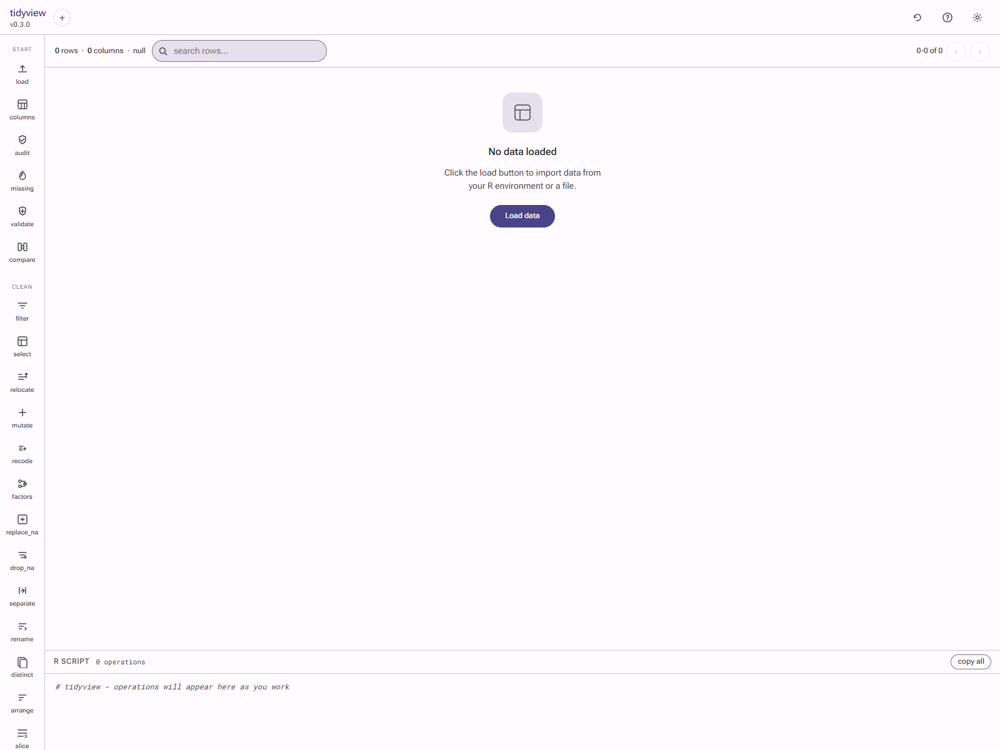
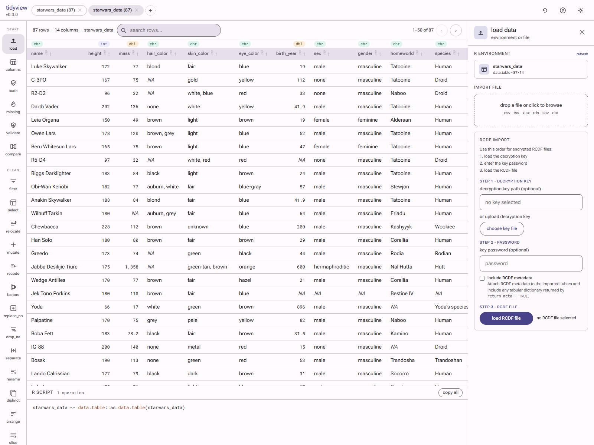
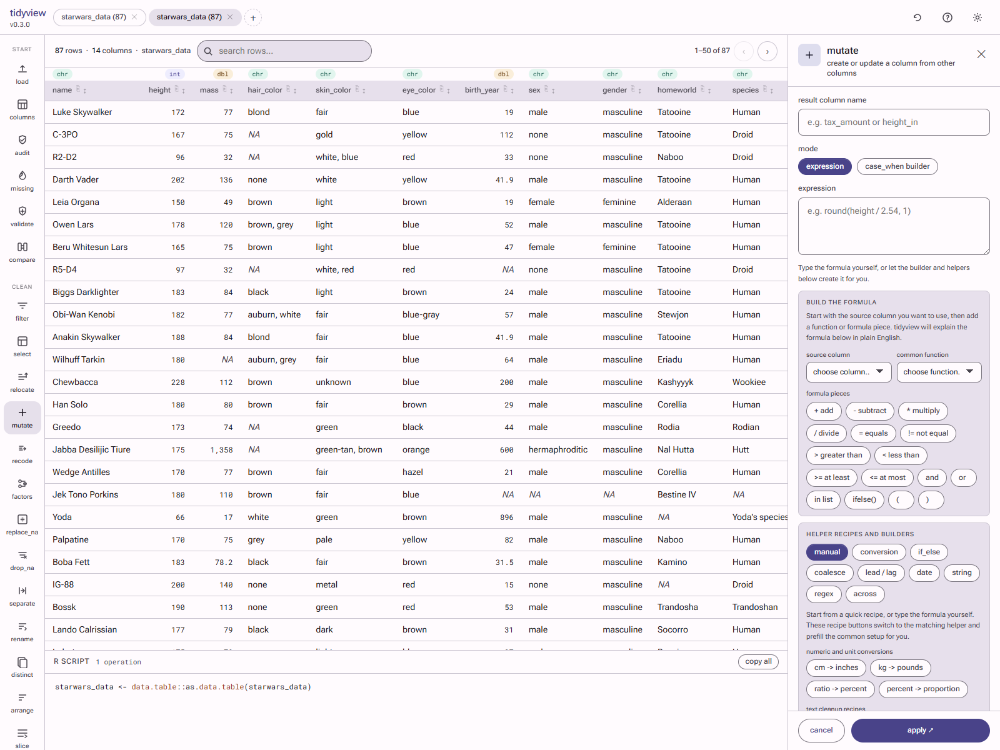
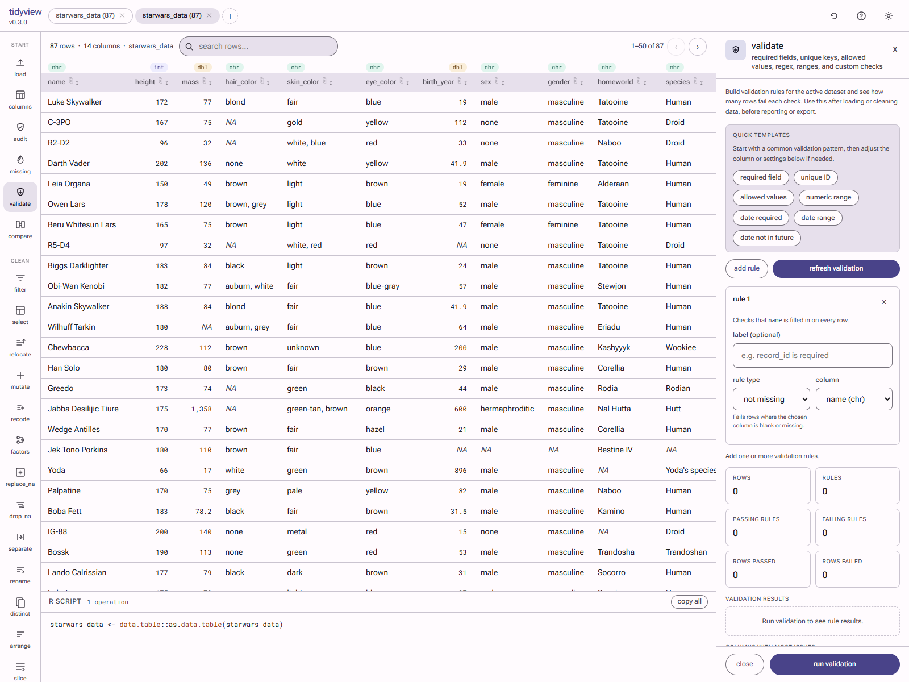
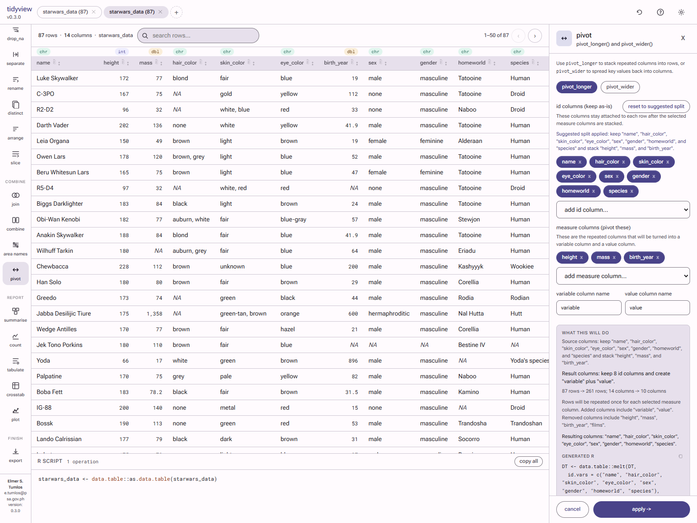
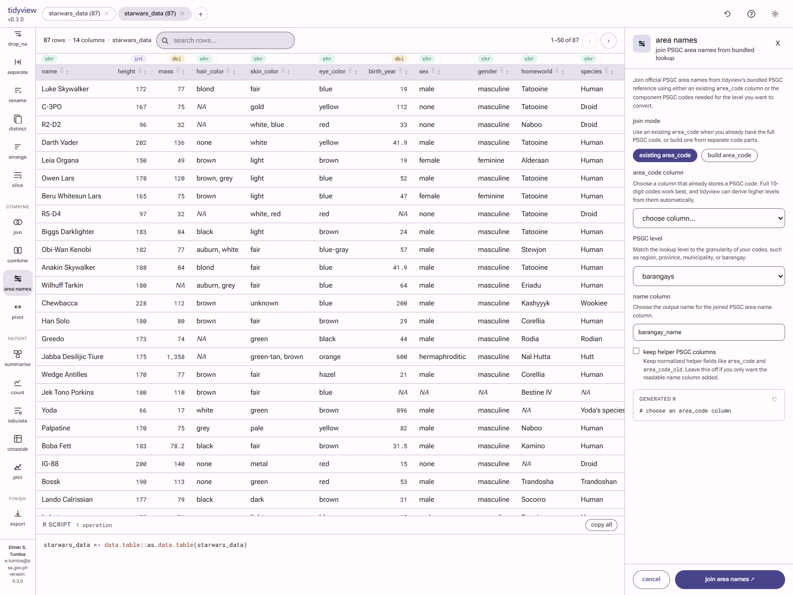
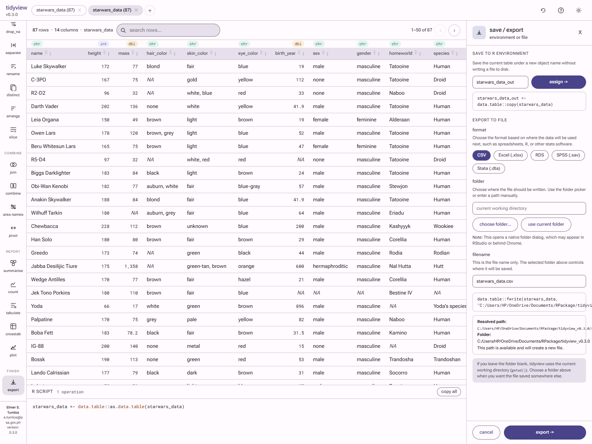

# tidyview

**A guided data workflow interface for R that stays transparent, teachable, and code-first.**

`tidyview` is a browser-based GUI for inspecting, cleaning, validating, reshaping, summarising, comparing, and exporting data. It is designed for analysts who want the speed and safety of a guided interface without losing access to the underlying R code.

Every interaction in `tidyview` generates runnable, paste-ready `data.table` code in a live script pane, so the interface helps users work faster while still making every transformation explicit.

## Why tidyview

`tidyview` is built for teams that need a practical middle ground between manual coding and opaque point-and-click tools.

It works especially well when you want to:

- inspect a dataset before making changes
- guide non-technical users through common data tasks
- preview the effect of destructive operations before applying them
- teach or learn `data.table` workflows from real generated code
- standardise recurring cleaning and reporting steps across a team

Instead of hiding transformations, `tidyview` exposes them. The UI explains what each step does, and the code pane records it in a form you can reuse in scripts, reports, or production workflows.

## What's New In 0.3.0

`tidyview 0.3.0` strengthens the package as a guided workflow environment rather than a thin wrapper around individual verbs.

Highlights include:

- recipe-style helpers in `mutate` for common conversions, text cleanup, and date helpers
- guided recode helpers for yes/no standardisation, label cleanup, and grouped recodes
- stronger previews for `join`, `compare`, `separate`, `unite`, and `pivot`
- safer `summarise` controls for missing values
- validation templates for required fields, unique IDs, allowed values, ranges, and date checks
- bundled PSGC lookup support for region, province, municipality, and barangay naming
- better audit and missing-data workflows with clearer prioritisation
- broader helper text across the major panels so the app reads more like a workflow than a raw function form

## Install

Install the latest development or release candidate version from GitHub:

```r
remotes::install_github("elmertumlos/tidyview")
```

On Windows, GitHub installation may require compatible local build tools
such as Rtools because the package is installed from source.

If you are distributing a prepared release file directly, users can also
install from a built tarball:

```r
install.packages(
  "C:/path/to/tidyview_0.3.0.tar.gz",
  repos = NULL,
  type = "source"
)
```

### For Developers

If you are working inside the package source directory and want to test
changes without reinstalling every time:

```r
devtools::load_all("C:/path/to/tidyview")
```

Developer checks such as `devtools::check()` or `devtools::check_built()`
may require compatible local build tools such as Rtools on Windows, even
when the package itself installs and runs normally from a built tarball.

## Launch The App

```r
library(tidyview)

# open with a data frame already in memory
tidygui(mtcars)

# open with a file-backed object
tidygui(data.table::fread("sales.csv"), name = "sales")

# open the import dialog first
tidygui()
```

By default, `tidygui()` launches a local browser app at `http://127.0.0.1:7474` and keeps generated R code visible as you work.

## Core Workflow Areas

`tidyview` covers the parts of day-to-day data work that analysts repeatedly return to:

- **Inspect and profile** data structure, column types, duplicates, missingness, and top values
- **Filter and select** rows and columns with guided controls and generated code
- **Mutate and recode** variables with safer helpers for text, dates, units, and categories
- **Summarise and tabulate** grouped results, frequency tables, and crosstabs
- **Join and compare** datasets with clearer diagnostics around keys, duplicates, and row impact
- **Reshape** data with guided `pivot_longer`, `pivot_wider`, `separate`, and `unite` flows
- **Validate** required fields, ranges, unique keys, and business rules
- **Audit and review missing data** before reporting or export
- **Plot and export** with lightweight charting and safer file output flow

## Design Principles

Three ideas drive the package:

1. **Guided, not opaque**  
   The interface explains what it is doing in plain language rather than expecting users to translate function signatures mentally.

2. **Safer by default**  
   High-impact operations provide previews, warnings, or decision support before changes are applied.

3. **Code always visible**  
   `tidyview` is not a black box. The script pane remains part of the workflow so users can learn from it or move seamlessly into programmatic work.

## Programmatic Helpers

The GUI is backed by lightweight helper functions that return a `data.table` and attach generated code in `attr(x, "tv_code")`.

```r
sales <- tv_fread("sales.csv")
sales <- tv_filter(sales, list(list(col = "region", op = "==", val = "North")))
sales <- tv_mutate(sales, "tax", "amount * 0.12")
sales <- tv_arrange(sales, list(list(col = "amount", desc = TRUE)))

audit_report <- tv_audit(sales, top_n = 5L)
missing_report <- tv_missing_summary(sales, group_by = "region")
validate_report <- tv_validate(
  sales,
  rules = list(
    list(type = "not_missing", col = "record_id"),
    list(type = "range", col = "amount", min = "0")
  )
)

attr(sales, "tv_code")
```

This makes `tidyview` useful both as an interactive tool and as a reproducible workflow generator.

## Screenshots

### Startup



### Load Panel



### Mutate Recipes



### Validation Templates



### Pivot



### Area Names



### Export



## Representative Operations

| Workflow | Typical generated `data.table` style |
|----------|--------------------------------------|
| Filter rows | `DT[condition]` |
| Select columns | `DT[, .(col1, col2)]` |
| Mutate | `DT[, new_col := expr]` |
| Summarise | `DT[, .(stat = fn(col)), by = group]` |
| Arrange | `DT[order(col)]` |
| Join | `merge(DT, lookup, by = "key")` |
| Pivot long | `melt(DT, id.vars = ..., measure.vars = ...)` |
| Pivot wide | `dcast(DT, formula, value.var = ...)` |
| Tabulate | `DT[, .(n = .N), by = .(col)]` |
| Crosstab | `dcast(DT[, .(n = .N), by = .(row, col)], row ~ col)` |
| Rename | `setnames(DT, old, new)` |
| Export | `fwrite(DT, "file.csv")` |

## Optional Integrations

`tidyview` works with a small required dependency set and uses optional packages only when a feature needs them.

Optional integrations include:

- `readxl` for Excel import
- `haven` for SPSS and Stata import/export
- `rcdf` for RCDF import
- `tsg` for frequency and crosstab helpers
- `writexl` for Excel export
- `rstudioapi` for a smoother folder picker when exporting from RStudio

PSGC area-name lookup is bundled into the package in `0.3.0`, so users do not need a separate PSGC package just to convert codes into region, province, municipality, or barangay names.

## Theming

`tidyview` uses a Material Design 3 visual system and can be themed with a seed colour:

```r
tidygui(mtcars, theme = m3_theme("#1D9E75"))
tidygui(mtcars, theme = m3_theme("#D85A30", dark = TRUE))
```

## License

MIT
